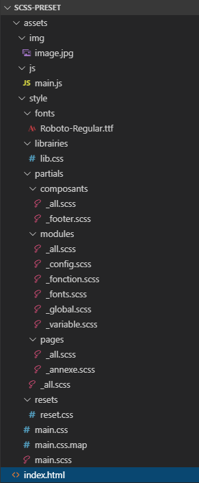

# scss-preset

Une architecture frontend simple et pratique, parsemées d'explications (voir sur chaques pages) pour initierliser tout le style d'un projet. (En français !)

Le code (pas les commentaires) est écrit évidemment en anglais, personne ne code en français.

(Certains noms de fichiers/dossiers ont changé au cour des versions, cette image doit être mise à jour)